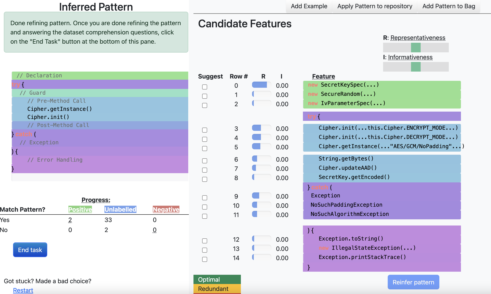

# SURF
Scaling Code Pattern Inference with Interactive What-If Analysis

## Summary of SURF 

SURF is an approach for active learning for code pattern inference.

It reduces users’ labelling effort, actively guide users in
assessing the implication of having a particular feature choice in the
constructed pattern, and incorporates direct feature-level feedback.
The key insight behind SURF is that users can effectively select
appropriate features with the aid of impact analysis. 

SURF summarizes the population of usages into a skeleton, useful for understanding a large population of how an API is used. The skeleton allows users to understand the distirbution of usages at a glance.

SURF provides
hints on the global distribution of how each feature is consistent
with already labelled positive and negative instances, and how
selection of a new feature can yield additional matching instances.
Its what-if-analysis contrasts how different feature choices can
include (or exclude) more instances in the rest of the population.



## Running


From the command line in the meteor_app directory, run
```
meteor
```
